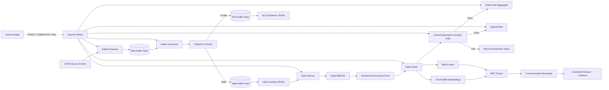
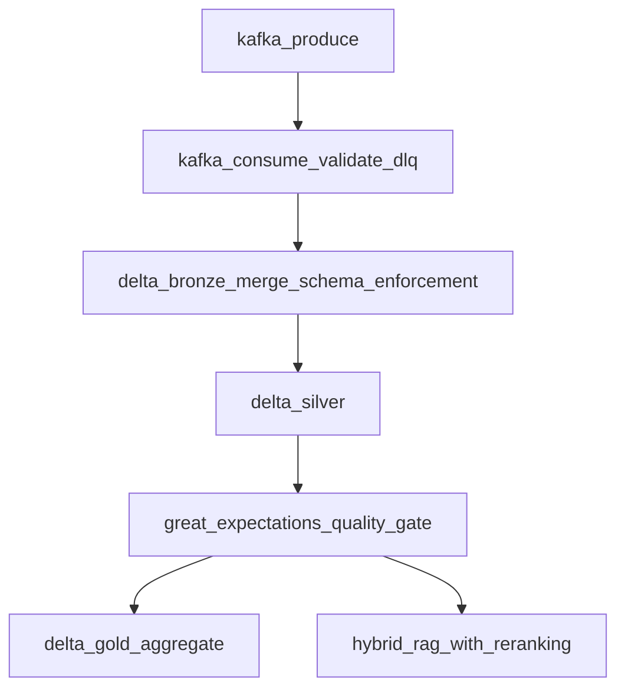
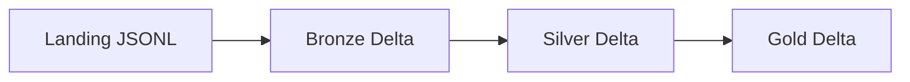
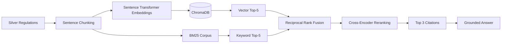

# Data Engineering for AI Systems — University Regulations

<p align="center">
  <strong>SDAIA Academy Capstone Project</strong><br>
  An end-to-end data engineering and AI retrieval system for university regulations.
</p>

<p align="center">
  
  
  
  
  
  
  
  
</p>

---

## Project Information

| Item | Details |
|---|---|
| Program | SDAIA Academy — Data Engineering for AI Systems |
| Project | University Regulations AI Data Pipeline |
| Repository | `Data-Engineering-for-AI-Systems-University-Regulations` |
| Environment | Visual Studio Code + Docker Desktop |
| Orchestrator | Apache Airflow |
| Message Broker | Apache Kafka in KRaft mode |
| Lakehouse | PySpark + Delta Lake |
| AI Component | Hybrid Retrieval-Augmented Generation |
| Supervisor | Mohammed Albeladi |

### Team Members

| Name | Email |
|---|---|
| Layan Alomar | layanomaralomar@gmail.com |
| Wajd Alotaibi | wajd.ashag@hotmail.com |
| Alathoob Alosaimi | AlathoobS@outlook.com |
| Reema Qublan | reem.qu@icloud.com |

---

## Table of Contents

1. [Project Overview](#project-overview)
2. [Problem Statement](#problem-statement)
3. [Project Motivation](#project-motivation)
4. [Objectives](#objectives)
5. [Key Features](#key-features)
6. [System Architecture](#system-architecture)
7. [End-to-End Data Flow](#end-to-end-data-flow)
8. [Airflow Workflow](#airflow-workflow)
9. [Technology Stack](#technology-stack)
10. [Source Dataset](#source-dataset)
11. [Data Contract](#data-contract)
12. [Kafka Ingestion](#kafka-ingestion)
13. [Validation and Dead-Letter Queue](#validation-and-dead-letter-queue)
14. [Medallion Architecture](#medallion-architecture)
15. [Delta Lake MERGE](#delta-lake-merge)
16. [Schema Enforcement](#schema-enforcement)
17. [Data Quality Gate](#data-quality-gate)
18. [Hybrid RAG Pipeline](#hybrid-rag-pipeline)
19. [OpenLineage Tracking](#openlineage-tracking)
20. [Controlled Failure Scenarios](#controlled-failure-scenarios)
21. [Repository Structure](#repository-structure)
22. [Environment Variables](#environment-variables)
23. [Prerequisites](#prerequisites)
24. [Installation](#installation)
25. [Running the Successful Pipeline](#running-the-successful-pipeline)
26. [Running the Failure Demonstration](#running-the-failure-demonstration)
27. [Submission Verification](#submission-verification)
28. [Testing](#testing)
29. [Expected Outputs](#expected-outputs)
30. [Evidence and Screenshots](#evidence-and-screenshots)
31. [Rubric Coverage](#rubric-coverage)
32. [Challenges and Design Decisions](#challenges-and-design-decisions)
33. [Future Improvements](#future-improvements)
34. [Acknowledgment](#acknowledgment)
35. [License](#license)

---

## Project Overview

University regulations are commonly distributed across multiple documents and are difficult for students to search efficiently. This project implements a complete production-style data engineering pipeline that receives regulation events, validates their structure, routes malformed records to a dead-letter queue, transforms valid data through a Delta Lakehouse, applies enforceable data-quality checks, records lineage events, and provides a grounded Hybrid RAG assistant with citations.

The project is intentionally designed as more than a simple ETL script. It demonstrates how streaming ingestion, schema contracts, lakehouse layers, workflow orchestration, quality gates, lineage, and AI retrieval can operate together in one reproducible system.

---

## Problem Statement

Students often need quick answers about course withdrawal, academic warnings, examinations, registration rules, transfer credit, and graduation requirements. Traditional document search may return broad or irrelevant results and may not clearly identify the source regulation.

The system addresses this by:

- Structuring university regulation data.
- Rejecting malformed events before they enter the analytical layers.
- Preserving invalid records and their rejection reasons.
- Maintaining clean Bronze, Silver, and Gold Delta tables.
- Combining semantic and keyword retrieval.
- Returning a grounded answer with regulation-level citations.
- Preventing AI retrieval from running when upstream data quality fails.

---

## Project Motivation

Modern AI systems depend on trustworthy data pipelines. A RAG application is only as reliable as the data that reaches its retrieval index. This project therefore treats data engineering, quality, and governance as core parts of the AI solution.

The implementation demonstrates that:

- Data contracts should be enforced at the ingestion boundary.
- Invalid data should be retained for investigation rather than silently discarded.
- Data transformations should be reproducible and auditable.
- Quality checks should block downstream systems, not merely produce reports.
- AI-generated responses should remain grounded in retrieved sources.
- Every executed stage should expose lineage states such as `START`, `COMPLETE`, and `FAIL`.

---

## Objectives

The main objectives are to:

1. Ingest university regulation records through a real Apache Kafka broker.
2. Validate incoming records using a Pydantic contract.
3. Route rejected records to a real Kafka dead-letter topic.
4. Preserve valid and invalid events as local evidence.
5. Build Bronze, Silver, and Gold Delta Lake layers using PySpark.
6. Demonstrate a real Delta `MERGE` using `regulation_id` as the business key.
7. Prove Delta schema enforcement by attempting a malformed append.
8. Apply Great Expectations checks as an actual Airflow quality gate.
9. Build a Hybrid RAG pipeline using embeddings, ChromaDB, BM25, RRF, and cross-encoder reranking.
10. Generate grounded answers with regulation citations.
11. Orchestrate the complete workflow using Apache Airflow.
12. Emit OpenLineage events for every executed stage.
13. Demonstrate successful and controlled-failure workflows.
14. Retain evidence files that can be reviewed during project evaluation.

---

## Key Features

| Feature | Implementation |
|---|---|
| Streaming ingestion | Real Kafka producer and consumer |
| Kafka mode | Single-node KRaft broker |
| Input validation | Pydantic `RegulationEvent` model |
| Invalid-event handling | Kafka DLQ + JSONL evidence |
| Lakehouse | Delta Lake Bronze, Silver, and Gold |
| Incremental logic | Delta `MERGE` on `regulation_id` |
| Schema proof | Invalid string year rejected by Delta |
| Data quality | Great Expectations validation suite |
| Quality enforcement | Failed quality task blocks Gold and RAG |
| Vector retrieval | ChromaDB with sentence-transformer embeddings |
| Keyword retrieval | BM25 |
| Retrieval fusion | Reciprocal Rank Fusion |
| Final ranking | Cross-encoder reranking |
| Grounding | Answer and top citations saved as JSON |
| Orchestration | Apache Airflow DAG |
| Lineage | OpenLineage `START`, `COMPLETE`, and `FAIL` events |
| Reproducibility | Docker Compose and PowerShell scripts |
| Automated checks | Pytest and submission verification script |

---

## System Architecture



---

## End-to-End Data Flow

```text
data/source/incoming_events.json
        │
        ▼
Kafka topic: university-regulations-raw
        │
        ▼
Pydantic RegulationEvent validation
        │
        ├── Valid ──► university-regulations-valid
        │             └──► data/landing/valid_events.jsonl
        │
        └── Invalid ► university-regulations-dlq
                      └──► data/landing/dlq_events.jsonl
                                    │
                                    ▼
                            Delta Bronze table
                                    │
                                    ├── MERGE update REG002
                                    ├── MERGE insert REG006
                                    └── Schema rejection proof
                                    │
                                    ▼
                            Delta Silver table
                       deduplicate + active only + features
                                    │
                                    ▼
                         Great Expectations gate
                           │                    │
                         Pass                  Fail
                           │                    └──► Gold and RAG blocked
                 ┌─────────┴─────────┐
                 ▼                   ▼
        Delta Gold aggregate     Hybrid RAG
                               Chroma + BM25
                                  + RRF
                              + Cross-Encoder
                                     │
                                     ▼
                       Grounded answer with citations
```

---

## Airflow Workflow

The Airflow DAG ID is:

```text
university_regulations_capstone
```

The DAG has no automatic schedule and is triggered manually or through the provided scripts.



### Task Dependency Chain

```text
kafka_produce
→ kafka_consume_validate_dlq
→ delta_bronze_merge_schema_enforcement
→ delta_silver
→ great_expectations_quality_gate
→ [delta_gold_aggregate, hybrid_rag_with_reranking]
```

Both Gold and RAG are downstream of the Great Expectations task. Airflow's default `all_success` trigger rule prevents them from running when the quality gate fails.

### DAG Configuration

| Property | Value |
|---|---|
| DAG ID | `university_regulations_capstone` |
| Schedule | `None` |
| Catchup | `False` |
| Start date | `2026-01-01` |
| Executor | `SequentialExecutor` |
| Tags | SDAIA, Kafka, Delta, RAG, OpenLineage |

---

## Technology Stack

### Core Platform

| Technology | Version / Purpose |
|---|---|
| Python | 3.11 |
| Docker Desktop | Container runtime |
| Docker Compose | Multi-service orchestration |
| Visual Studio Code | Development environment |
| Git | Version control |

### Data Engineering

| Technology | Purpose |
|---|---|
| Apache Kafka 3.9.1 | Event streaming and DLQ topics |
| kafka-python 2.0.2 | Python Kafka producer and consumer |
| Pydantic 2.x | Input schema and field validation |
| PySpark 3.5.0 | Distributed transformation engine |
| Delta Lake 3.2.0 | Transactional lakehouse tables |
| Pandas | DataFrame conversion for quality checks |
| PyArrow | Columnar data support |

### Quality and Governance

| Technology | Purpose |
|---|---|
| Great Expectations 1.x | Data quality expectations |
| OpenLineage | Stage-level lineage events |
| Pytest | Contract unit testing |

### AI and Retrieval

| Technology | Purpose |
|---|---|
| Sentence Transformers | Text embeddings |
| `all-MiniLM-L6-v2` | Embedding model |
| ChromaDB | Persistent vector store |
| BM25 | Keyword retrieval |
| Reciprocal Rank Fusion | Semantic and lexical result fusion |
| CrossEncoder | Final candidate reranking |
| `cross-encoder/ms-marco-MiniLM-L-6-v2` | Reranking model |

### Orchestration

| Technology | Purpose |
|---|---|
| Apache Airflow 2.10.5 | Pipeline scheduling and dependencies |
| PythonOperator | Executes each Python pipeline stage |

---

## Source Dataset

The source file is:

```text
data/source/incoming_events.json
```

It contains seven events:

| Type | Count |
|---|---:|
| Valid source events | 5 |
| Intentionally invalid events | 2 |
| Total source events | 7 |

### Valid Source Topics

The records cover:

- Course Withdrawal
- Academic Warning
- Exam Absence
- Course Prerequisites
- Graduation Requirements

### Invalid Test Records

The source intentionally includes:

1. A record with an empty `regulation_id`.
2. A record with `effective_year = 1990`.

These records prove that malformed events are rejected and routed to the DLQ.

### MERGE Test Records

During Bronze processing, two additional records are created:

- `REG002` is updated to **Academic Warning — Updated**.
- `REG006` is inserted as **Transfer Credit**.

This demonstrates both the matched-update and not-matched-insert branches of Delta `MERGE`.

---

## Data Contract

Incoming records are validated using the `RegulationEvent` Pydantic model.

### Required Fields

| Field | Type | Rule |
|---|---|---|
| `regulation_id` | String | Minimum length 1 |
| `title` | String | Minimum length 3 |
| `category` | String | Minimum length 3 |
| `text` | String | Minimum length 20 |
| `effective_year` | Integer | Between 2020 and 2035 |
| `status` | String | Must be `active` or `inactive` |

### Contract Example

```python
class RegulationEvent(BaseModel):
    regulation_id: str = Field(min_length=1)
    title: str = Field(min_length=3)
    category: str = Field(min_length=3)
    text: str = Field(min_length=20)
    effective_year: int
    status: str
```

Custom validators enforce:

```text
2020 ≤ effective_year ≤ 2035
status ∈ {"active", "inactive"}
```

Validation occurs before records are accepted into the valid topic and landing file.

---

## Kafka Ingestion

### Kafka Topics

| Topic | Purpose |
|---|---|
| `university-regulations-raw` | Receives all source events |
| `university-regulations-valid` | Receives validated records |
| `university-regulations-dlq` | Receives malformed records and rejection details |

### Producer

The producer:

1. Reads `data/source/incoming_events.json`.
2. Serializes each record as JSON.
3. Sends all seven records to the raw topic.
4. Waits for Kafka acknowledgments.
5. Flushes and closes the producer.

Expected producer output:

```text
Produced 7 records to university-regulations-raw
```

### Consumer

The consumer:

1. Reads from the raw topic.
2. Uses a unique validation consumer group.
3. Starts from the earliest available offset.
4. Disables automatic offset commits.
5. Validates each message with Pydantic.
6. Routes valid messages to the valid topic.
7. Routes rejected messages to the DLQ.
8. Stops after the configured expected event count.

Expected result:

```json
{
  "processed": 7,
  "valid": 5,
  "dlq": 2
}
```

---

## Validation and Dead-Letter Queue

Invalid Kafka events are not silently dropped. Each rejected event is wrapped in a DLQ record containing:

```json
{
  "original_event": {},
  "rejection_reason": "Pydantic validation error details",
  "source_topic": "university-regulations-raw",
  "source_offset": 0
}
```

The DLQ record is written to:

```text
Kafka topic:
university-regulations-dlq

Evidence file:
data/landing/dlq_events.jsonl
```

The pipeline fails if no malformed record reaches the DLQ, because the failure-path demonstration is a required part of the project.

---

## Medallion Architecture

The lakehouse follows Bronze, Silver, and Gold layers.



### Bronze Layer

Location:

```text
data/delta/bronze
```

Purpose:

- Preserve validated source records.
- Add `ingested_at`.
- Apply Delta `MERGE`.
- Demonstrate schema enforcement.

Bronze schema:

| Column | Type |
|---|---|
| `regulation_id` | String |
| `title` | String |
| `category` | String |
| `text` | String |
| `effective_year` | Integer |
| `status` | String |
| `ingested_at` | Timestamp |

Expected Bronze result after MERGE:

```json
{
  "bronze_rows_after_merge": 6,
  "schema_rejected": true
}
```

The initial five valid records become six because:

- `REG002` is updated.
- `REG006` is inserted.

### Silver Layer

Location:

```text
data/delta/silver
```

Silver transformations:

- Remove duplicate `regulation_id` values.
- Keep only `status = active`.
- Trim titles into `title_clean`.
- Calculate `text_length`.

Expected output:

```json
{
  "silver_rows": 6
}
```

Silver columns include:

| Column | Description |
|---|---|
| `regulation_id` | Business key |
| `title` | Source title |
| `category` | Regulation category |
| `text` | Regulation body |
| `effective_year` | Effective year |
| `status` | Active/inactive state |
| `ingested_at` | Bronze ingestion timestamp |
| `title_clean` | Trimmed title |
| `text_length` | Character count of regulation text |

### Gold Layer

Location:

```text
data/delta/gold
```

The Gold layer is a real aggregate, not a copy of Silver. It groups by `category` and calculates:

- `regulation_count`
- `average_text_length`

Expected category count:

```json
{
  "gold_categories": 4
}
```

Expected categories:

- Academic Standing
- Examinations
- Graduation
- Registration

---

## Delta Lake MERGE

The Bronze table uses a real Delta Lake `MERGE` with:

```text
Business key: regulation_id
```

Merge behavior:

```text
WHEN MATCHED:
    update title, category, text, effective_year, and status

WHEN NOT MATCHED:
    insert the complete record and ingestion timestamp
```

The test data proves both paths:

| Regulation ID | MERGE Result |
|---|---|
| `REG002` | Existing record updated |
| `REG006` | New record inserted |

This demonstrates idempotent business-key processing rather than a simple append-only implementation.

---

## Schema Enforcement

A malformed Spark DataFrame is intentionally created with:

```text
effective_year = "not-an-integer"
```

The existing Delta table expects:

```text
effective_year: IntegerType
```

The pipeline attempts to append the malformed DataFrame. Delta rejects the write, and the exception is saved to:

```text
docs/schema_enforcement_failure.txt
```

The stage fails if the malformed record is unexpectedly accepted.

Expected proof:

```text
EXPECTED_SCHEMA_ENFORCEMENT_FAILURE
```

Expected stage result:

```json
{
  "schema_rejected": true
}
```

---

## Data Quality Gate

The Great Expectations stage reads Silver into a Pandas DataFrame and evaluates a validation suite.

### Expectations

| Expectation | Purpose |
|---|---|
| `regulation_id` values are not null | Required business key |
| `regulation_id` values are unique | Prevent duplicate regulations |
| `status` values are in `["active"]` | Confirm Silver active-only rule |
| `effective_year` is between 2020 and 2035 | Valid policy period |
| `text` length is at least 20 | Prevent incomplete content |

The validation output is saved to:

```text
docs/quality_result.json
```

Successful output structure:

```json
{
  "success": true,
  "statistics": {
    "evaluated_expectations": 5,
    "successful_expectations": 5,
    "unsuccessful_expectations": 0,
    "success_percent": 100.0
  }
}
```

The exact statistics are generated by the installed Great Expectations version.

### Why This Is a Real Gate

The stage raises an exception when validation fails:

```text
Great Expectations quality gate failed; downstream stages are blocked
```

Because Gold and RAG depend on the quality task, Airflow does not schedule them after failure.

---

## Hybrid RAG Pipeline

The project implements a complete Hybrid RAG retrieval path.



### 1. Document Chunking

Each regulation text is divided into sentence-level chunks.

Chunk ID format:

```text
{regulation_id}_chunk_{index}
```

Example:

```text
REG003_chunk_0
```

Each chunk retains:

- Source regulation ID
- Title
- Category
- Text

### 2. Embeddings

Embedding model:

```text
all-MiniLM-L6-v2
```

The vector index is persisted under:

```text
data/chroma
```

Chroma collection name:

```text
university_regulations
```

### 3. Semantic Retrieval

ChromaDB returns up to five semantic matches for the query.

### 4. Keyword Retrieval

BM25 tokenizes the chunk corpus and retrieves the five highest lexical scores.

### 5. Reciprocal Rank Fusion

The project combines vector and BM25 ranks with:

```text
RRF score += 1 / (60 + rank)
```

This allows semantic and keyword retrieval to contribute to one candidate list.

### 6. Cross-Encoder Reranking

Reranking model:

```text
cross-encoder/ms-marco-MiniLM-L-6-v2
```

Each candidate is scored using the pair:

```text
[query, candidate_text]
```

The top three results become citations.

### 7. Grounded Answer

The implemented question is:

```text
What happens when a student misses a final examination?
```

The intended top regulation is:

```text
REG003 — Exam Absence
```

Grounded answer:

```text
A student who misses a final examination must submit an accepted excuse
through the official university procedure.
```

The output is saved to:

```text
docs/rag_answer.json
```

Output structure:

```json
{
  "question": "What happens when a student misses a final examination?",
  "grounded_answer": "Retrieved regulation text",
  "citations": [
    {
      "source": "REG003",
      "title": "Exam Absence",
      "text": "..."
    }
  ],
  "pipeline": [
    "chunking",
    "embeddings",
    "ChromaDB",
    "BM25",
    "RRF",
    "cross-encoder reranking"
  ]
}
```

The project uses the highest-ranked retrieved text directly as the grounded answer. It does not invent unsupported policy content.

---

## OpenLineage Tracking

Every major stage is wrapped by a reusable `lineage_stage` decorator.

For each executed stage, the decorator:

1. Generates a unique run ID.
2. Emits `START`.
3. Executes the stage.
4. Emits `COMPLETE` after success.
5. Emits `FAIL` when an exception occurs.

Events are written to:

```text
logs/openlineage/events.jsonl
```

### Lineage Namespace

| Item | Value |
|---|---|
| Job namespace | `sdaia-capstone` |
| Dataset namespace | `project` |
| Producer | `university-regulations-capstone` |

### Lineage Stages

| Stage Name | Inputs | Outputs |
|---|---|---|
| `01_kafka_produce` | Source JSON | Raw Kafka topic |
| `02_kafka_validate_consume` | Raw Kafka topic | Valid topic, DLQ, landing files |
| `03_delta_bronze_merge_schema` | Valid landing file | Bronze table, schema proof |
| `04_delta_silver` | Bronze table | Silver table |
| `05_quality_gate` | Silver table | Quality result |
| `06_delta_gold` | Silver table | Gold table |
| `07_rag_pipeline` | Silver table | Chroma index, RAG answer |

---

## Controlled Failure Scenarios

The project includes multiple intentional failure paths.

### 1. Pydantic Rejection

Invalid input:

- Empty `regulation_id`
- Invalid year `1990`

Expected result:

- Message sent to DLQ.
- Rejection reason retained.
- DLQ evidence written to JSONL.

### 2. Delta Schema Rejection

Invalid input:

```text
effective_year = "not-an-integer"
```

Expected result:

- Delta append rejected.
- Exception written to `docs/schema_enforcement_failure.txt`.

### 3. Great Expectations Failure

When the environment contains:

```text
FORCE_QUALITY_FAILURE=1
```

the quality function duplicates a Silver row in memory. This violates the uniqueness expectation for `regulation_id`.

Expected result:

- Quality task fails.
- Gold is blocked.
- RAG is blocked.
- OpenLineage emits a `FAIL` event.

### 4. RAG Blocking Guard

The RAG function contains an additional failure-run marker:

```text
docs/ERROR_rag_ran_after_failed_gate.txt
```

If RAG somehow runs while `FORCE_QUALITY_FAILURE=1`, this file is created. The failure script and verification script check that the marker does not exist.

---

## Repository Structure

```text
Data-Engineering-for-AI-Systems-University-Regulations/
│
├── .env.example
├── .gitignore
├── CONTRIBUTORS.md
├── Dockerfile
├── README.md
├── University_Regulations_Capstone_Evidence.ipynb
├── docker-compose.yml
├── requirements.txt
│
├── .vscode/
│   ├── extensions.json
│   └── tasks.json
│
├── dags/
│   └── university_regulations_capstone.py
│
├── data/
│   ├── source/
│   │   └── incoming_events.json
│   ├── landing/
│   │   ├── .gitkeep
│   │   ├── valid_events.jsonl             # Generated
│   │   └── dlq_events.jsonl               # Generated
│   ├── delta/
│   │   ├── .gitkeep
│   │   ├── bronze/                        # Generated
│   │   ├── silver/                        # Generated
│   │   └── gold/                          # Generated
│   └── chroma/
│       ├── .gitkeep
│       └── ...                            # Generated vector index
│
├── docs/
│   ├── ARCHITECTURE.md
│   ├── GITHUB_UPLOAD_GUIDE.md
│   ├── RUBRIC_CHECKLIST.md
│   ├── SUBMISSION_EVIDENCE.md
│   ├── project_manifest.json
│   ├── airflow_success_run.log            # Generated
│   ├── airflow_forced_quality_failure.log # Generated
│   ├── schema_enforcement_failure.txt     # Generated
│   ├── quality_result.json                # Generated
│   └── rag_answer.json                    # Generated
│
├── logs/
│   ├── .gitkeep
│   └── openlineage/
│       └── events.jsonl                   # Generated
│
├── scripts/
│   ├── create_topics.sh
│   ├── reset_topics.ps1
│   ├── run_failure.ps1
│   ├── run_failure_demo.py
│   ├── run_success.ps1
│   └── verify_submission.ps1
│
├── src/
│   ├── __init__.py
│   ├── contracts.py
│   ├── delta_pipeline.py
│   ├── kafka_pipeline.py
│   ├── lineage.py
│   ├── quality.py
│   ├── rag_pipeline.py
│   └── settings.py
│
└── tests/
    └── test_contracts.py
```

---

## Environment Variables

Copy the example file:

```powershell
Copy-Item .env.example .env
```

Or on Bash:

```bash
cp .env.example .env
```

Variables:

| Variable | Default Value | Purpose |
|---|---|---|
| `AIRFLOW_UID` | `50000` | Airflow container user |
| `KAFKA_BOOTSTRAP_SERVERS` | `kafka:9092` | Kafka broker address |
| `KAFKA_RAW_TOPIC` | `university-regulations-raw` | Raw input topic |
| `KAFKA_VALID_TOPIC` | `university-regulations-valid` | Valid-record topic |
| `KAFKA_DLQ_TOPIC` | `university-regulations-dlq` | Dead-letter topic |
| `EXPECTED_EVENT_COUNT` | `7` | Number of source events to consume |
| `PROJECT_ROOT` | `/opt/airflow/project` | Mounted project location |

Do not commit the real `.env` file.

---

## Prerequisites

Install:

1. Visual Studio Code
2. Docker Desktop
3. Git

Recommended:

- At least 8 GB RAM
- Stable internet during the first build
- Windows PowerShell for the included `.ps1` scripts
- Docker Engine running before starting the project

The first successful RAG run downloads the embedding and cross-encoder models, so it may take longer than later runs.

---

## Installation

### 1. Extract the Project

Extract the ZIP file and open the project folder in VS Code.

### 2. Create the Environment File

PowerShell:

```powershell
Copy-Item .env.example .env
```

Bash:

```bash
cp .env.example .env
```

### 3. Build and Start Services

```powershell
docker compose up --build -d
```

The first build installs Java, Airflow dependencies, Spark, Delta Lake, Great Expectations, ChromaDB, and sentence-transformer packages.

### 4. Check Containers

```powershell
docker compose ps
```

Expected containers:

| Container | Service | Port |
|---|---|---|
| `university-kafka` | Kafka | `9092` |
| `university-airflow` | Airflow | `8080` |

### 5. Open Airflow

```text
http://localhost:8080
```

Credentials:

```text
Username: admin
Password: admin
```

---

## Docker Architecture

### Kafka Service

The Kafka container uses:

```text
Image: apache/kafka:3.9.1
Mode: KRaft
Broker port: 9092
Controller port: 9093
Replication factor: 1
```

A health check waits for Kafka topic listing to succeed before Airflow starts.

### Airflow Service

The Airflow container:

- Is built from `apache/airflow:2.10.5-python3.11`.
- Installs OpenJDK 17 for Spark.
- Uses `SequentialExecutor`.
- Uses a local SQLite metadata database.
- Starts both the scheduler and webserver.
- Mounts the repository into `/opt/airflow/project`.
- Mounts DAGs into `/opt/airflow/dags`.
- Mounts logs into `/opt/airflow/logs`.

---

## Running the Successful Pipeline

From the project root in VS Code PowerShell:

```powershell
powershell -ExecutionPolicy Bypass -File scripts/run_success.ps1
```

The script:

1. Removes any incorrect RAG failure marker.
2. Deletes and recreates the Kafka topics.
3. Clears the existing OpenLineage event log.
4. Executes an Airflow test run for:
   ```text
   university_regulations_capstone
   ```
5. Uses logical date:
   ```text
   2026-07-22
   ```
6. Saves Airflow output to:
   ```text
   docs/airflow_success_run.log
   ```
7. Returns an error if the DAG does not complete successfully.

### Successful Run Sequence

```text
Kafka produce
→ Kafka consume and validate
→ Bronze + MERGE + schema proof
→ Silver
→ Great Expectations pass
→ Gold
→ Hybrid RAG
```

---

## Running the Failure Demonstration

Run:

```powershell
powershell -ExecutionPolicy Bypass -File scripts/run_failure.ps1
```

The script:

1. Removes any previous RAG error marker.
2. Resets Kafka topics.
3. Runs the DAG with:
   ```text
   FORCE_QUALITY_FAILURE=1
   ```
4. Uses logical date:
   ```text
   2026-07-23
   ```
5. Saves logs to:
   ```text
   docs/airflow_forced_quality_failure.log
   ```
6. Confirms that the DAG fails.
7. Confirms that RAG did not run.
8. Confirms that OpenLineage contains a `FAIL` event.
9. Exits successfully only when the controlled failure behaves correctly.

Expected terminal message:

```text
Controlled failure succeeded: quality gate failed, RAG was blocked,
and FAIL lineage was emitted.
```

---

## Submission Verification

After both successful and failed runs:

```powershell
powershell -ExecutionPolicy Bypass -File scripts/verify_submission.ps1
```

The script checks:

- Required documentation files exist.
- Successful Airflow log exists.
- Forced-failure Airflow log exists.
- Delta schema failure evidence exists.
- Quality result exists.
- RAG result exists.
- OpenLineage event log exists.
- DLQ evidence is not empty.
- Bronze, Silver, and Gold `_delta_log` directories exist.
- RAG output contains at least one citation.
- OpenLineage contains `START`, `COMPLETE`, and `FAIL`.
- RAG did not execute after the failed quality gate.

Expected result:

```text
All required evidence files and automated checks passed.
```

---

## Testing

Run contract tests inside the Airflow container:

```powershell
docker compose exec airflow pytest -q /opt/airflow/project/tests
```

The current tests verify:

1. A valid regulation contract is accepted.
2. An invalid contract raises `ValidationError`.

Expected result:

```text
2 passed
```

---

## Expected Outputs

### Core Runtime Results

| Stage | Expected Result |
|---|---|
| Producer | 7 records produced |
| Kafka validation | 5 valid, 2 DLQ |
| Bronze after MERGE | 6 rows |
| Schema enforcement | Rejected |
| Silver | 6 active unique records |
| Quality gate | Success during normal run |
| Gold | 4 categories |
| RAG | Grounded answer + 3 ranked citations |
| Lineage | START and COMPLETE for successful stages |
| Failure run | Quality FAIL and downstream blocking |

### Generated Evidence Files

```text
data/landing/valid_events.jsonl
data/landing/dlq_events.jsonl

data/delta/bronze/_delta_log/
data/delta/silver/_delta_log/
data/delta/gold/_delta_log/

data/chroma/

docs/schema_enforcement_failure.txt
docs/quality_result.json
docs/rag_answer.json
docs/airflow_success_run.log
docs/airflow_forced_quality_failure.log

logs/openlineage/events.jsonl
```

### Expected Quality Output

```json
{
  "success": true,
  "statistics": {
    "evaluated_expectations": 5,
    "successful_expectations": 5,
    "unsuccessful_expectations": 0
  }
}
```

### Expected RAG Output

```json
{
  "question": "What happens when a student misses a final examination?",
  "grounded_answer": "A student who misses a final examination must submit an accepted excuse through the official university procedure.",
  "citations": [
    {
      "source": "REG003",
      "title": "Exam Absence",
      "text": "A student who misses a final examination must submit an accepted excuse through the official university procedure."
    }
  ]
}
```

The final file may contain up to three citations because the cross-encoder keeps the top three candidates.

---

## Evidence and Screenshots

Recommended screenshots for submission:

### 1. Docker Services

Run:

```powershell
docker compose ps
```

Capture both `university-kafka` and `university-airflow` as running.

### 2. Airflow DAG Graph

Capture the DAG graph showing:

```text
kafka_produce
→ kafka_consume_validate_dlq
→ delta_bronze_merge_schema_enforcement
→ delta_silver
→ great_expectations_quality_gate
→ [delta_gold_aggregate, hybrid_rag_with_reranking]
```

### 3. Successful Airflow Run

Capture all DAG tasks in the success state.

### 4. Kafka DLQ Evidence

Open:

```text
data/landing/dlq_events.jsonl
```

Show rejected records and rejection reasons.

### 5. Delta Tables

Show:

```text
data/delta/bronze/_delta_log
data/delta/silver/_delta_log
data/delta/gold/_delta_log
```

### 6. Schema Rejection

Open:

```text
docs/schema_enforcement_failure.txt
```

### 7. Great Expectations Result

Open:

```text
docs/quality_result.json
```

### 8. RAG Result

Open:

```text
docs/rag_answer.json
```

Show the grounded answer and citations.

### 9. OpenLineage Events

Open:

```text
logs/openlineage/events.jsonl
```

Show `START`, `COMPLETE`, and `FAIL`.

### 10. Controlled Failure

Capture the Airflow run where:

- `great_expectations_quality_gate` fails.
- `delta_gold_aggregate` does not run.
- `hybrid_rag_with_reranking` does not run.

---

## Evidence Notebook

The repository includes:

```text
University_Regulations_Capstone_Evidence.ipynb
```

The notebook documents the Docker and Airflow execution commands and can display:

- `docs/quality_result.json`
- `docs/rag_answer.json`
- `logs/openlineage/events.jsonl`

The actual pipeline is executed through Docker Compose and Airflow rather than simulated inside the notebook.

---

## Rubric Coverage

### Ingestion

- [x] Real Apache Kafka broker
- [x] Real Kafka producer
- [x] Real Kafka consumer
- [x] Pydantic validation at ingestion boundary
- [x] Real Kafka DLQ topic
- [x] Rejection reason retained
- [x] Malformed records demonstrated

### Delta Lakehouse

- [x] Real Delta Bronze layer
- [x] Real Delta Silver layer
- [x] Real aggregate Gold layer
- [x] Real Delta `MERGE`
- [x] Business key: `regulation_id`
- [x] Schema-enforcement rejection demonstrated

### Hybrid RAG

- [x] Document chunking
- [x] Sentence-transformer embeddings
- [x] Persistent Chroma vector store
- [x] BM25 keyword retrieval
- [x] Reciprocal Rank Fusion
- [x] Cross-encoder reranking
- [x] Grounded answer
- [x] Regulation citations

### Orchestration

- [x] Real Apache Airflow DAG
- [x] Correct task dependencies
- [x] Quality gate before Gold and RAG
- [x] Failed gate blocks downstream tasks
- [x] Successful Airflow log retained
- [x] Controlled-failure log retained

### Quality and Lineage

- [x] Great Expectations suite
- [x] Quality checks operate as a task gate
- [x] OpenLineage `START`
- [x] OpenLineage `COMPLETE`
- [x] OpenLineage `FAIL`
- [x] Stage inputs and outputs included

### Documentation and Submission

- [x] Professional README
- [x] Architecture documentation
- [x] Rubric checklist
- [x] Evidence guide
- [x] Contributors file
- [x] Sensible repository structure
- [x] `.gitignore`
- [x] Docker environment
- [x] Automated evidence verification
- [ ] Publish to the trainee GitHub account
- [ ] Maintain authentic incremental commit history

---

## Challenges and Design Decisions

### Real Kafka Instead of Mock Events

The project uses an actual Kafka broker and actual Kafka topics. This makes the ingestion and DLQ evidence more realistic and verifiable.

### KRaft Mode

Kafka runs without ZooKeeper. A single broker acts as both broker and controller, reducing the number of containers needed for the capstone environment.

### Business-Key MERGE

`regulation_id` was selected as the stable business key because each regulation should represent one logical record across updates.

### Silver as the Quality Boundary

Quality checks operate on Silver because this layer represents the cleaned and deduplicated dataset that downstream analytics and AI components consume.

### Gold and RAG as Parallel Downstream Tasks

Gold and RAG both depend on the same quality gate. They run independently after quality succeeds but are both blocked by the same failure.

### Hybrid Retrieval

Vector retrieval captures semantic similarity, while BM25 preserves exact keyword relevance. RRF combines both without requiring score normalization.

### Cross-Encoder Final Ranking

A cross-encoder is more computationally expensive than embedding similarity, so it is used only after retrieval fusion on a small candidate set.

### Grounded Answer Design

The system returns the top regulation text directly instead of adding unsupported generative content. This keeps the answer auditable and clearly tied to its citation.

---

## Known Limitations

- The source dataset is intentionally small and created for capstone demonstration.
- Kafka runs as a single broker with one partition per topic.
- Airflow uses `SequentialExecutor` and SQLite for local development.
- ChromaDB runs locally rather than as a distributed service.
- The RAG query is currently fixed in the source code.
- The answer uses retrieved text directly and does not call an external LLM.
- Great Expectations uses an in-memory Pandas DataFrame.
- The pipeline rebuilds local Delta and Chroma data during the demonstration.
- Authentication and authorization are not configured for a production deployment.
- Generated runtime evidence is local unless explicitly committed.

---

## Future Improvements

Potential extensions include:

1. Replace the sample dataset with official university regulation documents.
2. Add PDF and web-page ingestion.
3. Add document versioning and effective-date history.
4. Use Kafka Schema Registry.
5. Introduce multiple partitions and consumer scaling.
6. Deploy Kafka and Airflow with production-grade persistence.
7. Move Airflow metadata to PostgreSQL.
8. Use a distributed Spark cluster.
9. Add Delta Change Data Feed.
10. Add partitioning and table optimization.
11. Add Great Expectations checkpoints and HTML Data Docs.
12. Publish lineage events to a dedicated OpenLineage backend such as Marquez.
13. Add an API for dynamic RAG questions.
14. Add a web interface for students.
15. Add Arabic regulation support and multilingual embeddings.
16. Add an LLM generation layer with strict context-only prompting.
17. Add retrieval metrics such as Recall@K, MRR, and nDCG.
18. Add answer-quality evaluation.
19. Add CI/CD through GitHub Actions.
20. Add container security scanning and secret management.
21. Add monitoring for Kafka lag, Airflow task duration, and model latency.
22. Add role-based access control and audit logs.
23. Add automated integration and end-to-end tests.

---

## Useful Commands

### Start Services

```powershell
docker compose up --build -d
```

### Check Services

```powershell
docker compose ps
```

### View Logs

```powershell
docker compose logs -f airflow
```

```powershell
docker compose logs -f kafka
```

### Run Successful Pipeline

```powershell
powershell -ExecutionPolicy Bypass -File scripts/run_success.ps1
```

### Run Controlled Failure

```powershell
powershell -ExecutionPolicy Bypass -File scripts/run_failure.ps1
```

### Verify Evidence

```powershell
powershell -ExecutionPolicy Bypass -File scripts/verify_submission.ps1
```

### Run Tests

```powershell
docker compose exec airflow pytest -q /opt/airflow/project/tests
```

### List Kafka Topics

```powershell
docker exec university-kafka /opt/kafka/bin/kafka-topics.sh --bootstrap-server localhost:9092 --list
```

### Stop Services

```powershell
docker compose down
```

### Stop and Remove Volumes

```powershell
docker compose down -v
```

---

## GitHub Submission Notes

Before uploading:

1. Run the success workflow.
2. Run the controlled failure workflow.
3. Run submission verification.
4. Review `.gitignore`.
5. Confirm that no secrets are included.
6. Confirm that the repository name is correct.
7. Add screenshots to a documentation folder if required.
8. Push using authentic incremental commits.

Suggested commit sequence:

```text
chore: initialize repository structure and documentation
feat: add Kafka producer consumer and Pydantic contract
feat: route malformed events to Kafka DLQ
feat: implement Delta Bronze Silver and Gold layers
feat: add Delta MERGE and schema enforcement proof
feat: add Great Expectations quality gate
feat: implement Hybrid RAG with BM25 RRF and reranking
feat: emit OpenLineage stage events
feat: orchestrate pipeline with Apache Airflow
test: add Pydantic contract tests
docs: add architecture evidence and rubric documentation
```

---

## Acknowledgment

This capstone project was developed as part of the SDAIA Academy **Data Engineering for AI Systems** program.

Special thanks to the project supervisor:

**Mohammed Albeladi**

for the training, technical guidance, and support throughout the project.

---

## License

This repository is intended for educational and capstone-submission purposes. Add an explicit open-source license only after confirming the team and program requirements.

---
## Training Program

This project was completed as part of the **SDAIA Academy – Modern Data Engineering for AI Systems** capstone.

Official SDAIA Academy GitHub:
https://github.com/SDAIAAcademy
<p align="center">
  Built by Layan Alomar, Wajd Alotaibi, Alathoob Alosaimi, and Reema Qublan.
</p>
