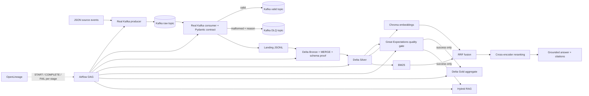

# Architecture

Airflow dependency chain:

`kafka_produce → kafka_consume_validate_dlq → delta_bronze_merge_schema_enforcement → delta_silver → great_expectations_quality_gate → [delta_gold_aggregate, hybrid_rag_with_reranking]`

Gold and RAG are both downstream of the quality gate. A failed Great Expectations task prevents both from running.
